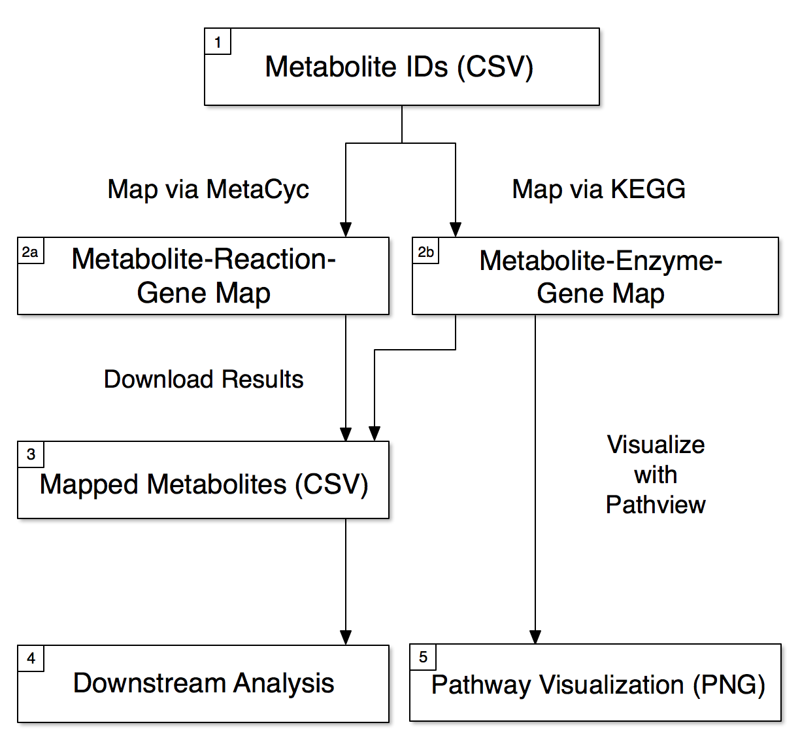

# MetaBridge


## Description
MetaBridge is a data integration system for integration of metabolomics data with other omics types, chiefly transcriptomics and proteomics.

## Contents


## Usage
MetaBridge is designed to facilitate integrative analysis by identifying the enzymes that directly interact with metabolites of interest. A pipeline may be designed as such:



## To-Do

## Feature Updates
- Better handle MetaCyc Ontology
  + Example: [Lactate](https://metacyc.org/compound?orgid=META&id=L-LACTATE#tab=ONT)
  + One of the reactions lactate participates in (listed under the Reactions tab) is [EC 3.1.1.1](https://metacyc.org/META/NEW-IMAGE?type=REACTION&object=CARBOXYLESTERASE-RXN). 
  + However, if you look up this reaction in a SmartTable of all reactions, the listed participants are: Carboxylates, Carboxylic-esters, Alcohols, WATER, PROTON. 
  + Lactate is a Carboxylate, but we do not currently have that ontology accounted for in our system! 
  + If we look back at the [Lactate](https://metacyc.org/compound?orgid=META&id=L-LACTATE#tab=ONT) entry in MetaCyc, we can find the annotation on the Ontology tab. However, this annotation is difficult to build in a SmartTable. It is technically possible, by selecting [Transform] -> [Ontology - parents of class], but this produces limited results. In the case of Lactate, it *only* provides us with 'L-2-hydroxyacids' and 'Lactate'. This is compared to the rich and complex results we get on the compound's page, listed below:

- an acid
  - all carboxy acids
    - a carboxylate
      - a hydroxylated carboxylate
        - a 2-hydroxy carboxylate
          - a (2S)-2-hydroxycarboxylate
            - (S)-lactate
          - lactate
            - (S)-lactate
      - a short-chain carboxylate
        - lactate
          - (S)-lactate

I think the best fix for this will be to simply interact *directly* with the MetaCyc database, importing the flat files into a local database installation and querying that directly. 
 

## UI Fixes
- Prompt user to select metabolite in summary table (make this table smaller?)
- Make it clear that summary table isn't what is downloaded. (allow downloading of summary?)
- Remove HTML from downloaded KEGG table
- Block back button or reload navigation
- Change location of download button to inside table?

- Remove `+AC0` from MetaCyc Reaction IDs
  + Link to MetaCyc Reactions
- Refactor table display to new functions which wrap table in HTML on command


### Errors:

- Can't make table that is not yet displayed invisible

```js
Uncaught TypeError: Cannot set property 'innerHTML' of null
```

- Be able to choose import column by clicking on DT
- Have to click twice on summary table?