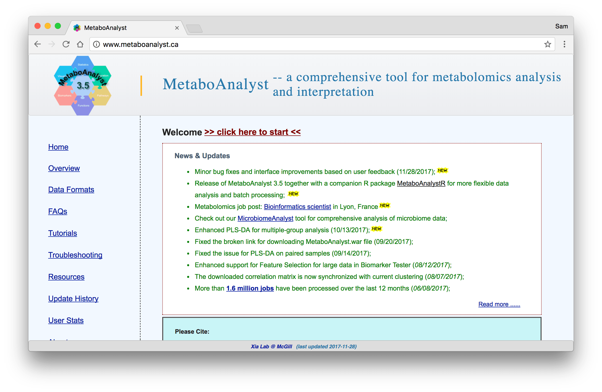
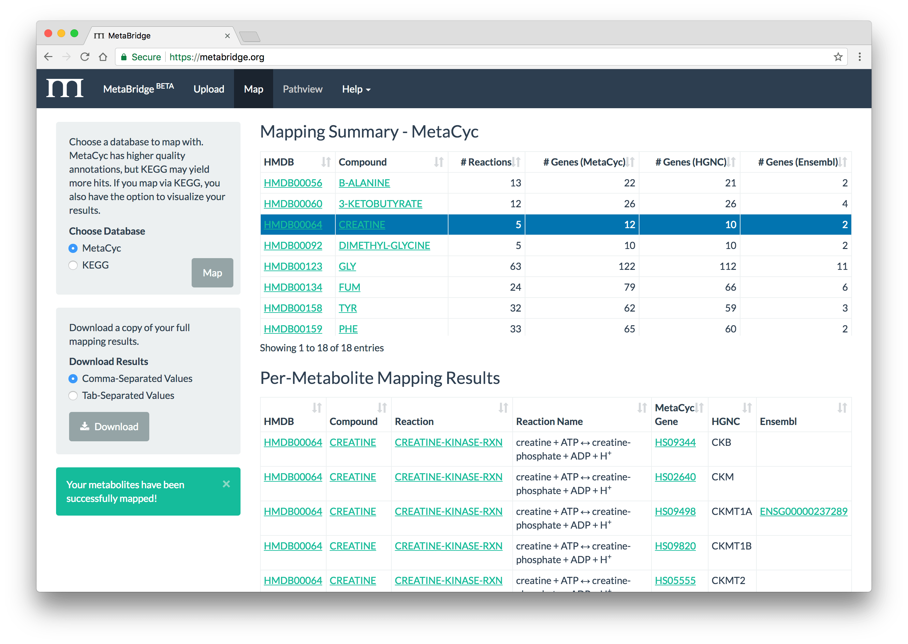
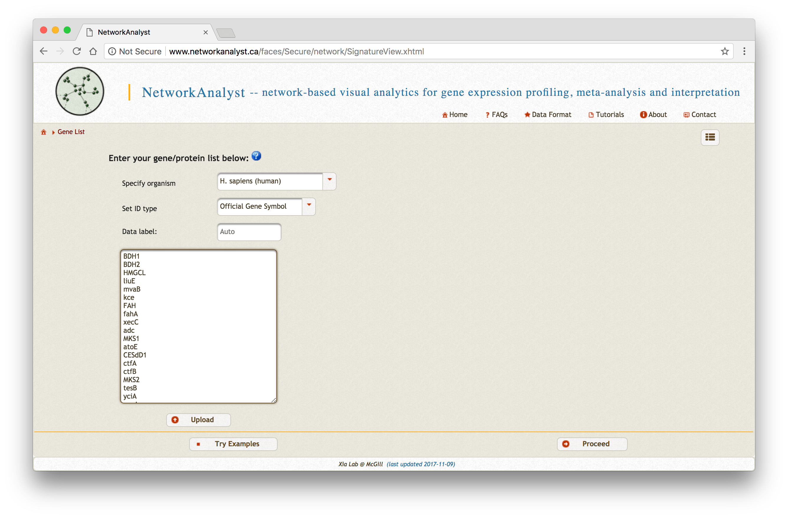
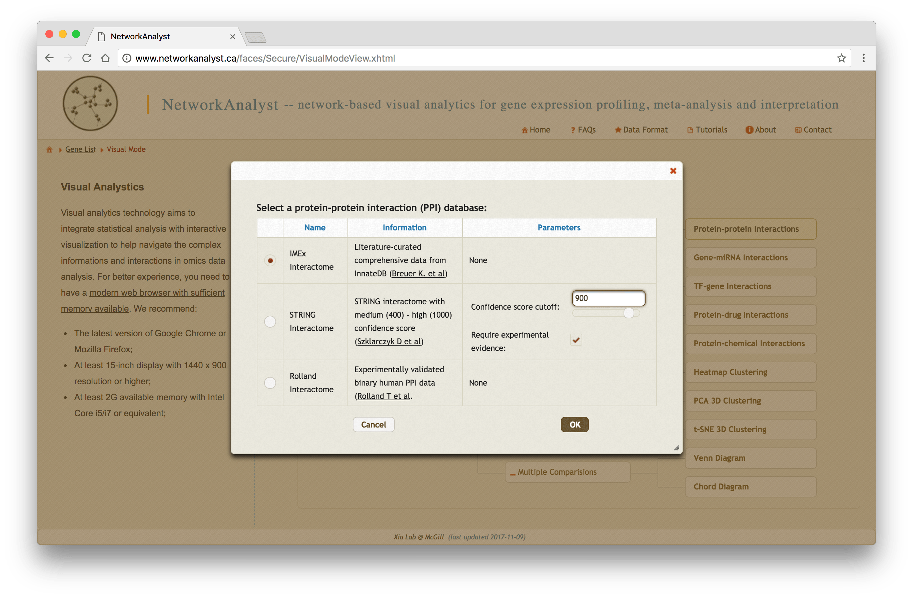
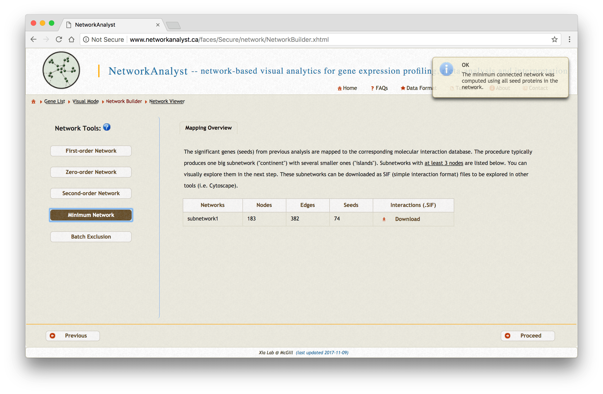
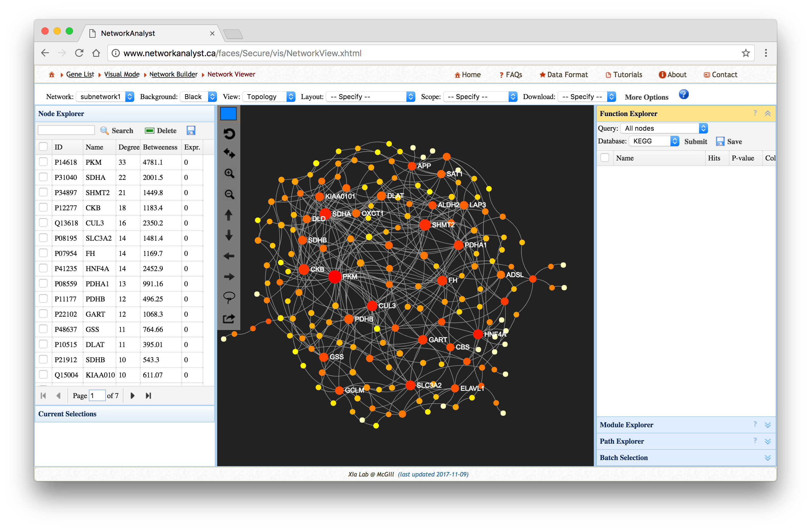
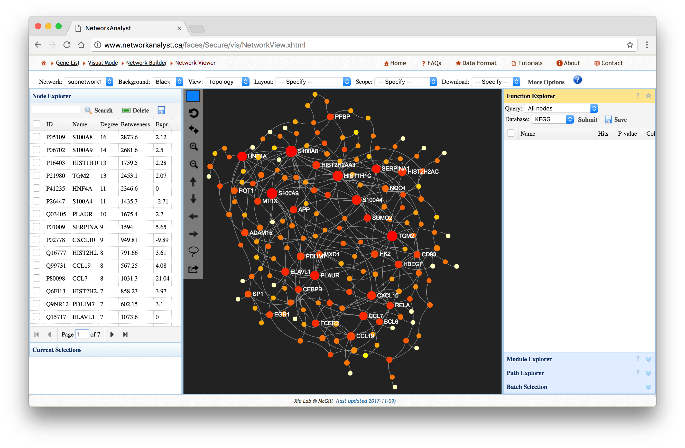
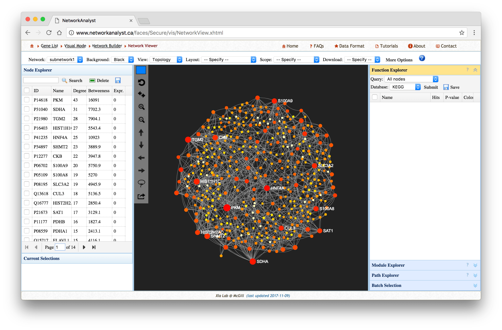

<h2 id='metabolite-preprocessing'>Metabolite Preprocessing</h2>

Preprocess your metabolites in your method of choice to obtain IDs for your compounds of interest.
We recommend [MetaboAnalyst](http://www.metaboanalyst.ca) for metabolite preprocessing.

---

<h2 id='metabridge-mapping'>MetaBridge Mapping</h2>

### Upload Metabolites

Upload your metabolites to MetaBridge and select your metabolites for mapping.

### Map Metabolites

Choose a database to map against and view your mapping results.

### Download

Download your full mapping results (example picture below).

<table class="table table-dark table-hover table-bordered">
  <thead class="thead-dark">
    <tr>
      <th>MetaCyc Gene</th>
      <th>Gene Name</th>
      <th>Ensembl</th>
    </tr>
  </thead>
  <tbody>
    <tr>
      <td>HS08579</td>
      <td>BDH1</td>
      <td>ENSG00000161267</td>
    </tr>
    <tr>
      <td>HS08987</td>
      <td>BDH2</td>
      <td>ENSG00000164039</td>
    </tr>
    <tr>
      <td>HS04116</td>
      <td>HMGCL</td>
      <td>ENSG00000117305</td>
    </tr>
    <tr>
      <td>G-12374</td>
      <td>liuE</td>
      <td>NA</td>
    </tr>
    <tr>
      <td>G-9191</td>
      <td>mvaB</td>
      <td>NA</td>
    </tr>
    <tr>
      <td>G-10295</td>
      <td>kce</td>
      <td>NA</td>
    </tr>
    <tr>
      <td>HS02536</td>
      <td>FAH</td>
      <td>ENSG00000103876</td>
    </tr>
  </tbody>
</table>

---

<h2 id='networkanalyst'>NetworkAnalyst</h2>

### Upload Mapped Genes

Visit NetworkAnalyst and start with [A list of genes or proteins] input. Upload the genes that you
mapped via MetaBridge, as well as any gene or protein sets you wish to integrate. Label them
accordingly. **Development Note: Update this screenshot showing multiple gene lists uploaded.**

Next, choose [Network Analysis -> Protein-protein interactions] and choose the literature-curated
IMEX Interactome as your protein-protein interaction database.

### Create Networks

For each gene or protein list you uploaded, create a minimum-connected PPI network. If your data are
particularly dense, you may be able to use zero-order interaction networks. If your data are
particularly sparse, you may need to use first-order interaction networks.

