<h2 id='metabolite-preprocessing'>I. Metabolite Preprocessing (Optional)</h2>

To start using MetaBridge, you need to upload a list of compounds of interest as
metabolite IDs. If you are starting with raw metabolomics data, you will need to
preprocess your metabolites with your method of choice to obtain compounds of
interest and their corresponding metabolite IDs. We recommend
[MetaboAnalyst](http://www.metaboanalyst.ca) for metabolite preprocessing.

[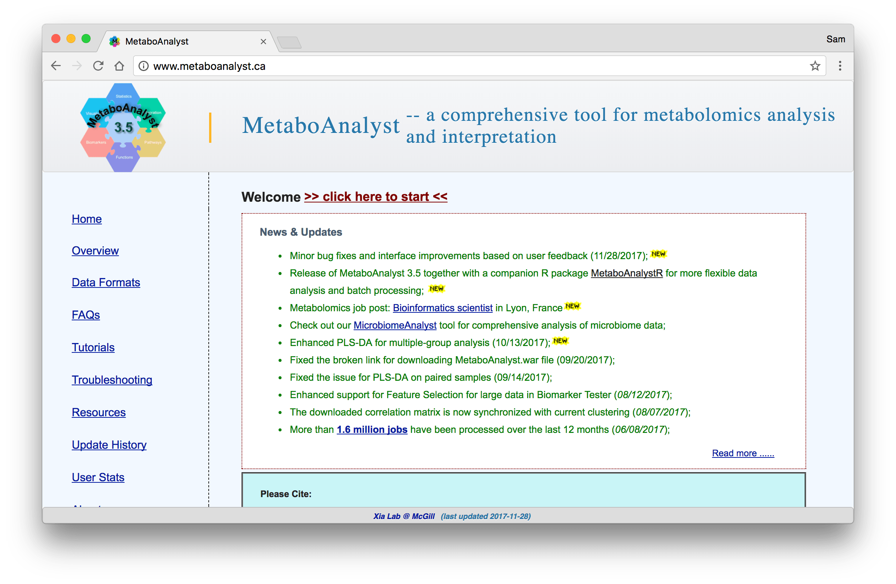](http://www.metaboanalyst.ca)

---

<h2 id='metabridge-mapping'>II. <a href="https://www.metabridge.org">MetaBridge</a> Mapping</h2>

### 1. Upload Metabolites

Upload your metabolites to [MetaBridge](https://www.metabridge.org) and select your metabolites for mapping.

[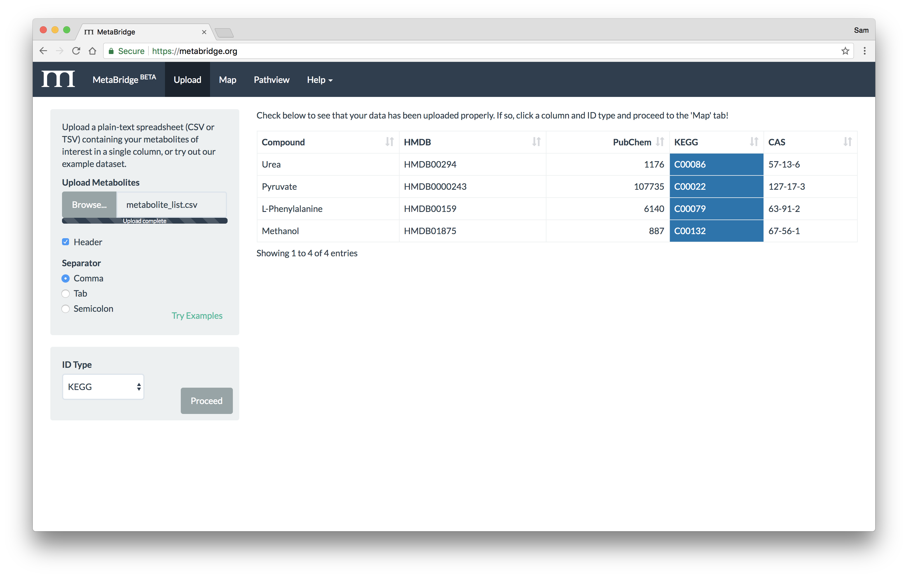](https://www.metabridge.org)

### 2. Map Metabolites

Choose a database to map against and view your mapping results.

[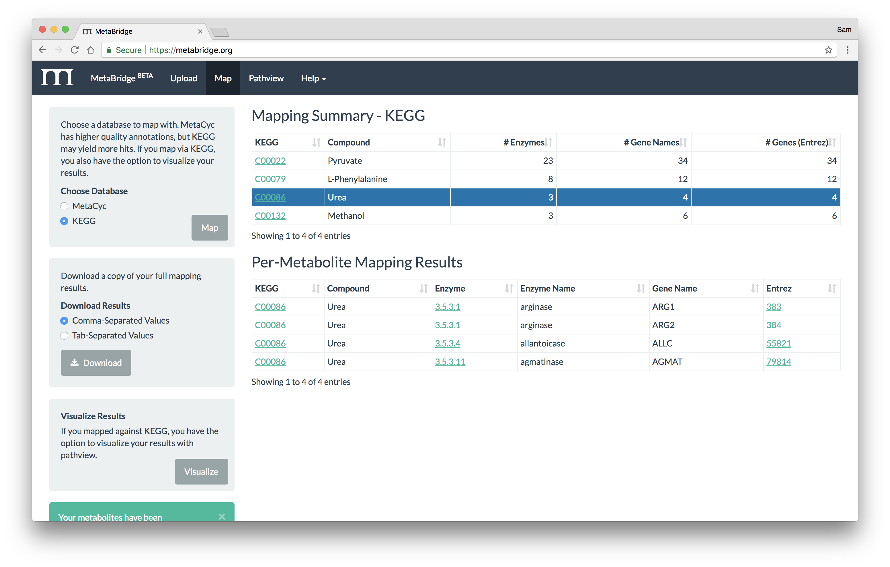](https://www.metabridge.org)

### 3. Download Results

Download your full mapping results (example table below).

<table class="table table-dark table-hover table-bordered">
  <thead class="thead-dark">
    <tr>
      <th>KEGG</th>
      <th>Compound</th>
      <th>Enzyme</th>
      <th>Enzyme Name</th>
      <th>Gene Name</th>
      <th>Entrez</th>
    </tr>
  </thead>
  <tbody>
    <tr>
      <td>C00086</td>
      <td>Urea</td>
      <td>3.5.3.1</td>
      <td>arginase</td>
      <td>ARG1</td>
      <td>383</td>
    </tr>
    <tr>
      <td>C00086</td>
      <td>Urea</td>
      <td>3.5.3.1</td>
      <td>arginase</td>
      <td>ARG2</td>
      <td>384</td>
    </tr>
    <tr>
      <td>C00086</td>
      <td>Urea</td>
      <td>3.5.3.4</td>
      <td>allantoicase</td>
      <td>ALLC</td>
      <td>55821</td>
    </tr>
    <tr>
      <td>C00086</td>
      <td>Urea</td>
      <td>3.5.3.11</td>
      <td>agmatinase</td>
      <td>AGMAT</td>
      <td>79814</td>
    </tr>
    <tr>
      <td>C00022</td>
      <td>Pyruvate</td>
      <td>1.1.1.27</td>
      <td>L-lactate dehydrogenase</td>
      <td>LDHAL6A</td>
      <td>160287</td>
    </tr>
  </tbody>
</table>

---

<h2 id='networkanalyst'>III. <a href="http://www.networkanalyst.ca">NetworkAnalyst</a></h2>

### 1. Upload Mapped Genes

Visit [NetworkAnalyst](http://www.networkanalyst.ca) and start with [A list of genes or proteins](http://www.networkanalyst.ca/faces/Secure/network/SignatureView.xhtml) input.

[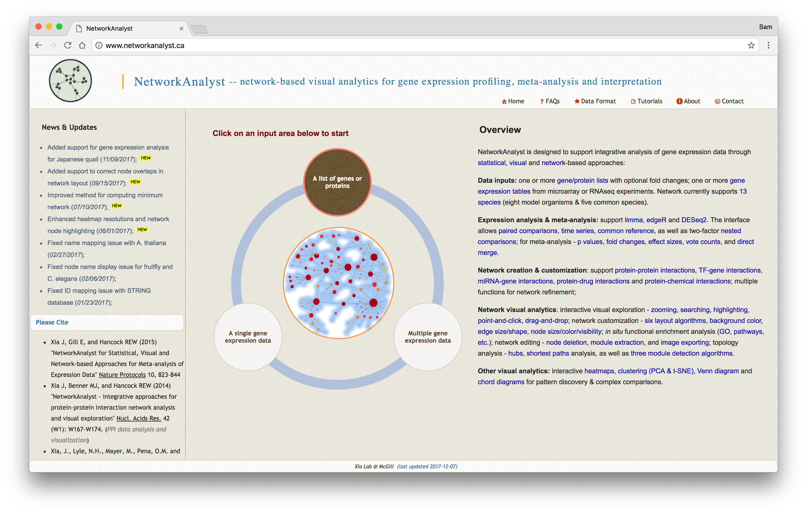](http://www.networkanalyst.ca)

* Upload the genes that you mapped via MetaBridge, providing an appropriate data label.
* Repeat this for each gene or protein list you wish to integrate.
* Then, paste into the box BOTH lists you wish to combine to create one COMBINED
  list. NetworkAnalyst will filter out duplicates for you.

[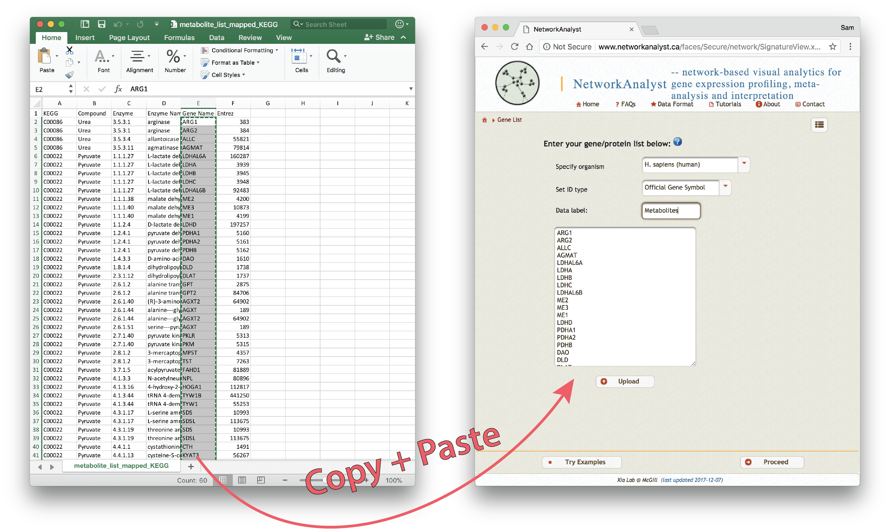](http://www.networkanalyst.ca/faces/Secure/network/SignatureView.xhtml)

 

Once you have uploaded all of your gene/protein lists, check the dropdown menu
to check that everything was properly uploaded, and select a dataset to start
with.

* Example of uploaded lists below:
  * MetaBridge-mapped Metabolites (54 unique genes)
  * Gene Expression Data (99 unique genes)
  * Combined Gene Lists (153 unique genes)

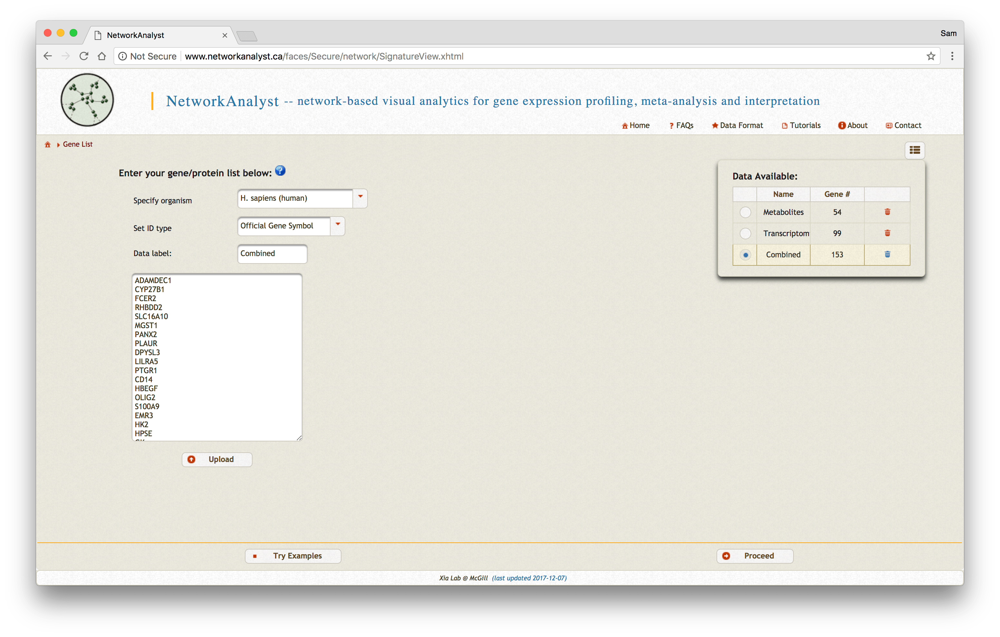

Next, choose [Network Analysis -> Protein-protein interactions] and choose the literature-curated
IMEX Interactome as your protein-protein interaction database.

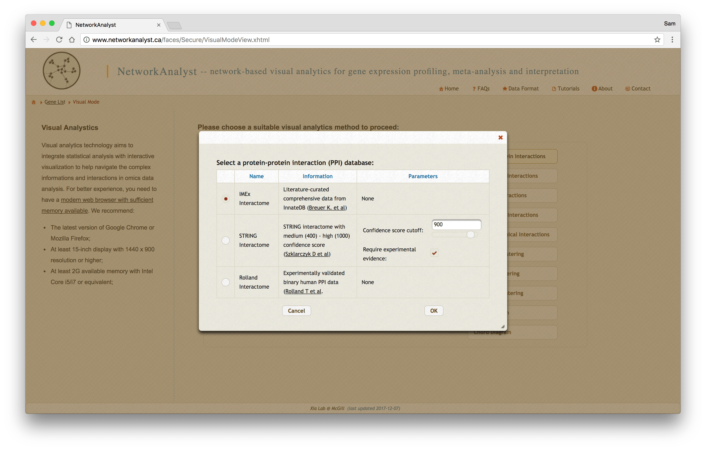

### 2. Create Networks

Now, a protein-protein interaction network will be generated based on the data
you have uploaded. Depending on the size of the dataset you have uploaded, you
may wish to choose from the network sizes on the lefthand size. Generally, we
recommend using a minimum-connected protein-protein interaction network.
However, if your data are particularly sparse, you may need to use first-order
interaction networks, whereas if your dataset is particularly large, you may
wish to use a zero-order interaction network. Typically, we aim for a network
containing a few hundred nodes.

Also if importance here is the [Batch Exclusion] tool. This tool is quite
helpful in filtering out proteins that you know to be highly connected in the
cell, but not if interest to the condition you are studying. One of the most
common proteins we filter out is UBC (uniprot ID P0CG48).

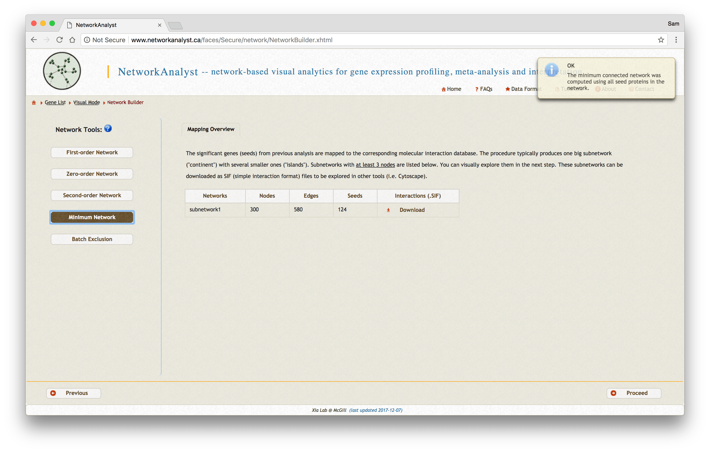

Below, you will find an example of each minimum-connected network generated

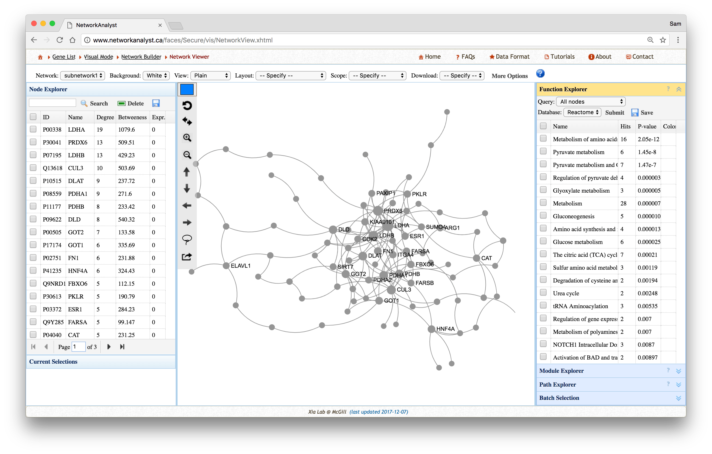

1. Minimum-connected protein-protein interaction network from MetaBridge-mapped metabolites.

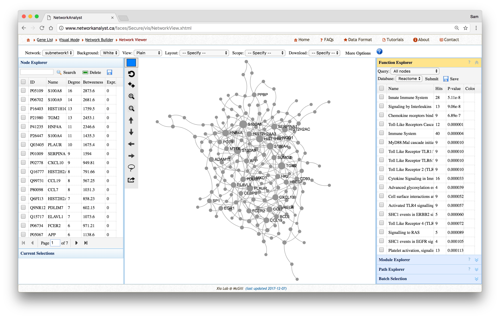

2. Minimum-connected protein-protein interaction network from gene expression data.

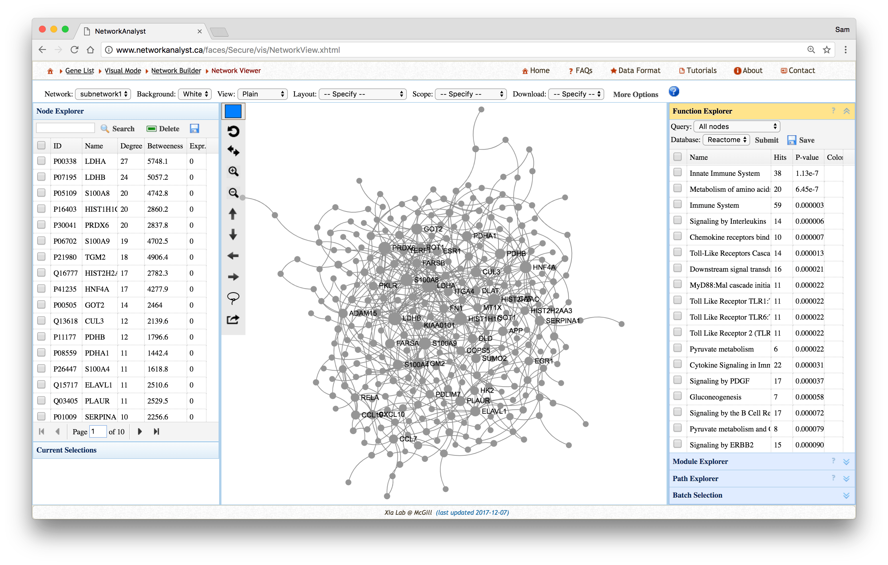

3. Minimum-connected protein-protein interaction network from combined gene list.

### 3. NetworkAnalyst Analyses

For each network you create, you can extract various information from the
network. For example, you can use the [Function Explorer] panel on the righthand
side to view pathway enrichment analyses of the networks. On the lefthand side,
you can use the [Node Explorer] to view information about individual nodes of
the network and [Save] the entire node list as a CSV file for further analysis.

You can also tweak the network appearance as you would like. For example, you
can paste in your original lists to the [Batch Selection] panel and color-code
each node of the network corresponding to its original data source. Then, you
can download image files of the networks you have created.

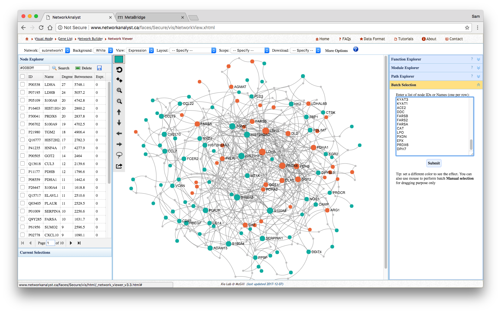

### 4. Further NetworkAnalyst Tools

In addition to network creation, you can use NetworkAnalyst's extensive suite of
tools, such as the [Venn Diagram] or [Chord Diagram] tools to examine overlap of
your datasets. For example, you can examine the overlap of your
MetaBridge-mapped genes with your other datasets.

To examine overlap of your protein-protein interaction networks, you can upload
the genes contained in your networks (from the downloaded node tables) and use
the Venn Diagram function to explore network overlap.

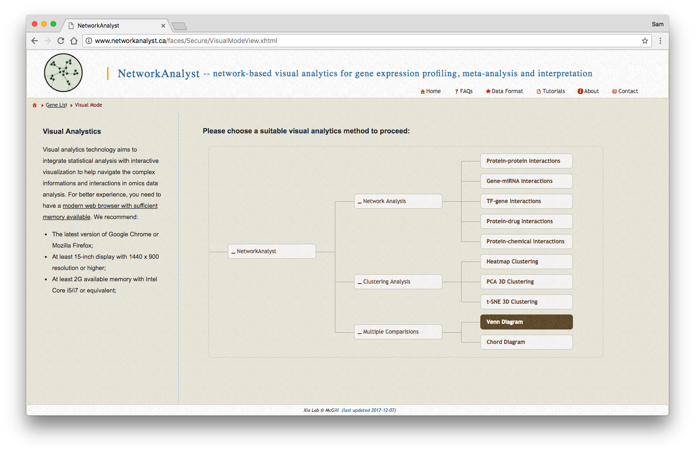
